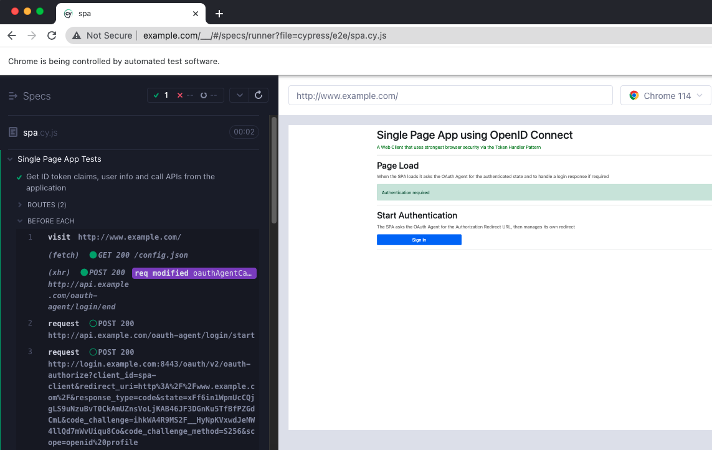

# Automated UI Tests

The SPA project includes some Cypress resources to enable UI tests to be run:

```bash
npm run uitests
```

This will spin up the Chrome browser and run UI tests against the login operations:



Various other operations are possible, as explained in the [Cypress docs](https://docs.cypress.io/guides/guides/command-line).\
Some example commands are shown here, which can be integrated into `package.json`` if required:

| Description | Command | 
| ----------- | ------- |
| Open the main Cypress console | cypress open |
| Run tests without a user interface | cypress run --headless --browser chrome |
| Merge test reports | npx mochawesome-merge cypress/reports/separate-reports/*.json > cypress/reports/index.json |
| Generate a test report | npx marge --reportDir cypress/reports/ cypress/reports/index.json |
