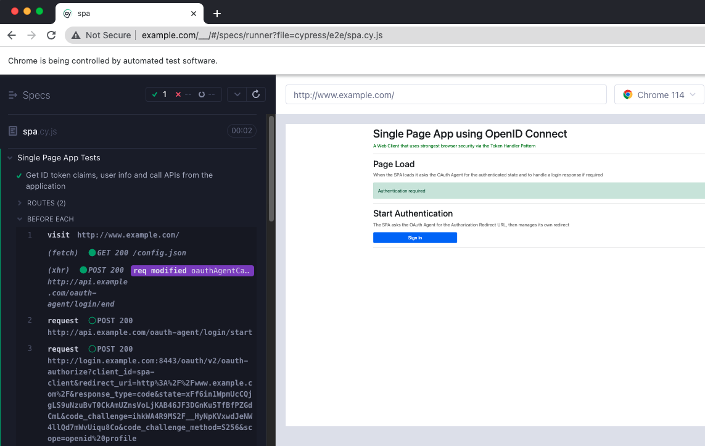

# Automated UI Tests

The SPA project includes some Cypress resources to show how to run automated tests for login related logic:

```bash
cd spa
npm run uitests
```

This will spin up the Chrome browser and run UI tests against the login operations:



## Test Parameters

URLs used by tests are specified in the `cypress.config.ts` file and can be overridden if required.\
When using the financial grade example deployment, set them as follows:

```typescript
env: {
    ORIGIN: 'https://www.example.com',
    LOGIN_START_URL: 'https://api.example.com/oauth-agent/login/start',
    IDSVR_BASE_URL: 'https://login.example.com:8443',
}
```

If HTTP URLs are used, some browsers may redirect the origin to an HTTPS URL.\
In this case, reload the browser at an HTTP URL of `http://www.example.com`.

## Additional Commands

Various other operations are possible, as explained in the [Cypress docs](https://docs.cypress.io/guides/guides/command-line).\
Some example commands are shown here, which could be added as scripts to `package.json`:

| Description | Command | 
| ----------- | ------- |
| Open the main Cypress console | cypress open |
| Run tests without a user interface | cypress run --headless --browser chrome |
| Generate a test report HTML file | npx mochawesome-merge cypress/reports/separate-reports/*.json > cypress/reports/index.json && npx marge --reportDir cypress/reports/ cypress/reports/index.json |
